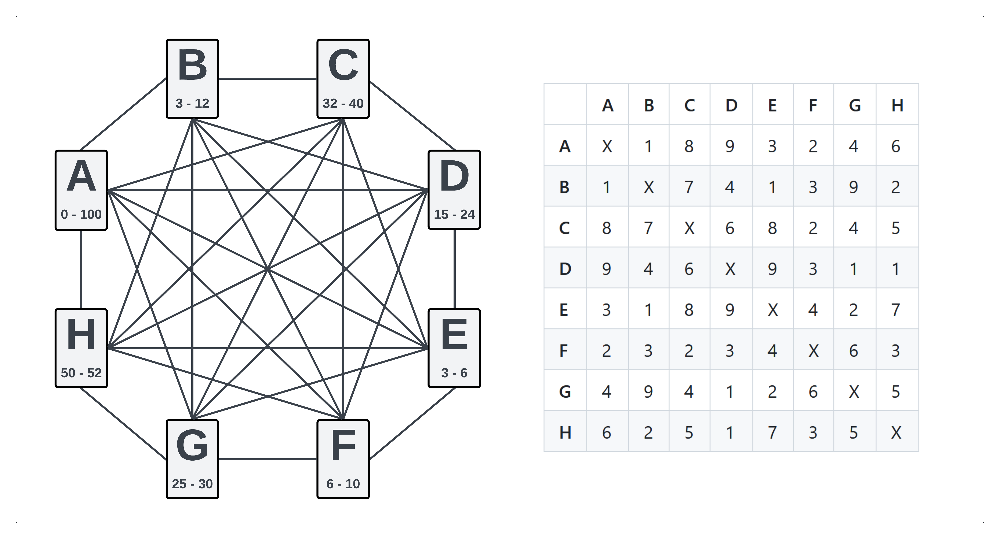
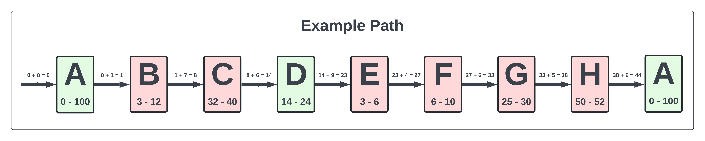
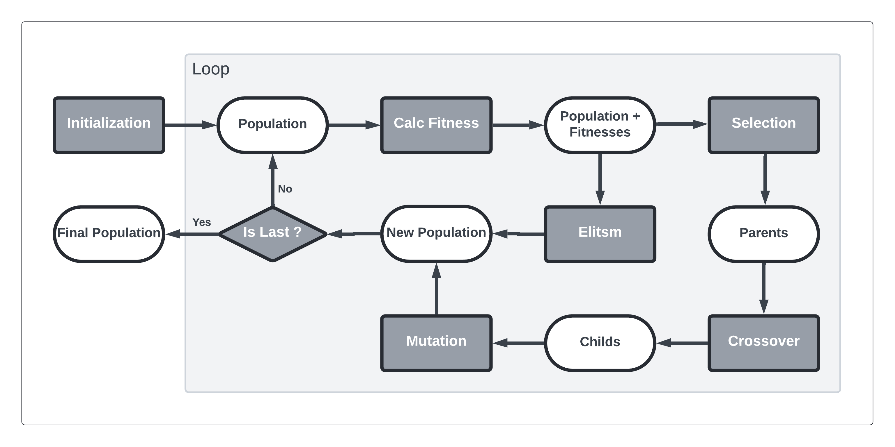
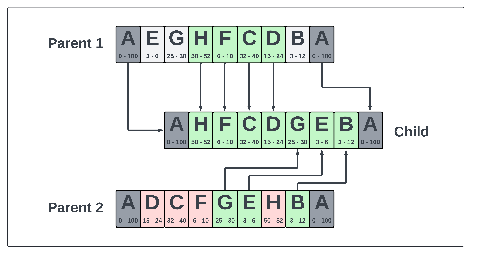
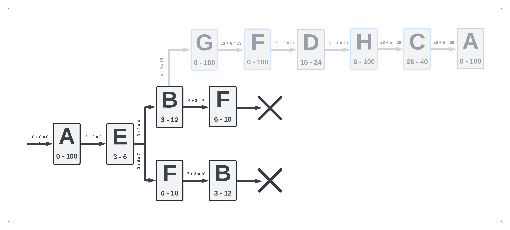

# Traveling Salesman Problem with Time Windows

The Traveling Salesman Problem with Time Windows (TSP-TW) is an extension of the classic Traveling Salesman Problem (TSP) where each city must be visited within a specific time frame. This additional constraint transforms the problem from simpy finding the shortest possible route to also ensuring that each city is visited within its specified time window. This dual objective makes TSP-TW significantly more challenging and relevant for real-world applications such as logistics, delivery routing, and scheduling.

In this project, we address the TSP-TW using two distinct approaches: brute force and genetic algorithms. The brute force approach involves evaluating all possible permutations of city visits to find the optimal route. While this guarantees the identification of the best solution, it is computationally expensive and impractical for large datasets. On the other hand, the genetic algorithm (GA) mimics the process of natural selection to iteratively evolve a population of candidate solutions, offering a more scalable alternative that approximates optimal solutions in a reasonable timeframe.

## Problem Overview

The Traveling Salesman Problem (TSP) is a well-known optimization challenge where the objective is to find the shortest possible route that visits a set of cities exactly once and returns to the starting city. The Traveling Salesman Problem with Time Windows (TSP-TW) adds an extra layer of complexity by introducing time windows for each city. This means that not only must the route be the shortest, but each city must also be visited within a specific time frame.

### The problem is defined by:

<p align="center">
   
</p>

In the figure, the left side shows the cities and the connections between them, with each city's time window displayed below its name. On the right side, there is a table that presents the distances between each pair of cities.

### To be solved:

1. **Is there any feasible solution to the problem?** <br/> Can the agent leave city A, visit each of the cities exactly once, and return to city A while arriving at each city within its specified time window? It is assumed that no time is spent in each city.

2. **Minimize the total penalty:** <br/> A penalty of 1 unit per city is applied if the agent arrives outside the specified time window. Find the tour that minimizes the total penalty, aiming to have as few cities as possible violate their time windows.

3. **Minimize the total cost:** <br/> The cost of the trip is the length of the trip plus the amount of penalties. For example, if the trip takes 48 units of time and there are two time-window violations, the total cost is 48 + 2 = 50. The objective is to minimize this total cost.
  
### Example:

The following figure illustrates a path (far from optimal) to demonstrate the calculation of costs. <br/> 
(The time window for City D was modified!)

<p align="center">
   
</p>

In the path, you can observe the time window constraints below each city, along with the time taken to travel between them. The red nodes indicate cities where the time constraints are violated.

- **Total penalty:** 6
- **Total time:** 44
- **Total cost:** 50 (44+6)

## Solution Approaches

We approach the TSP-TW problem through two distinct methods, brute force and genetic algorithms. Thanks to that brute force guarantees the identification of the best solution, so we can check the accuracy of the Genetic Algorithm.

- **Brute Force:** <br/> The brute force method exhaustively evaluates all possible permutations of the cities to identify the optimal route. While this guarantees the best solution, its computational demands make it impractical for larger datasets.

- **Genetic Algorithm:** <br/> The genetic algorithm approach employs evolutionary principles to find an optimal solution. It evolves a population of candidate solutions over multiple generations.

### Genetic Algorithm Workflow

<p align="center">
   
</p>

#### 1. Initialization
The algorithm begins by initializing various parameters and creating an initial population of potential solutions:
- **Parameters**: `population_size`, `generations`, `mutation_rate`, and `elite_size` are set based on configuration.
- **Population**: An initial population of individuals (paths) is created by randomly shuffling the list of cities.

#### 2. Fitness Calculation
For each individual in the population, the fitness is calculated. The fitness can be based on:
- **Time**: The total travel time for the path.
- **Penalty**: The total number of violated time constraints 
- **Cost**: A combination of time and penalty.

#### 3. Elitism
A portion of the best-performing individuals (elites) from the current generation is carried over to the next generation without modification:
- **Elite Selection**: The top `elite_size` individuals based on fitness are selected.

#### 4. Selection
The algorithm selects individuals from the population to serve as parents for the next generation:
- **Selection Method**: Individuals are chosen based on their fitness, with a higher chance of selecting individuals with better fitness scores (lower time, penalty, or cost).

#### 5. Crossover
The algorithm performs crossover between pairs of parents to generate offspring:
- **Gene Selection**: A segment of genes (cities) is selected from one parent, and the remaining genes are taken from the other parent, ensuring no duplicates.
- **Children Generation**: Two children are produced from each pair of parents.


<p align="center">
   
</p>

#### 6. Mutation
The algorithm applies mutation to the offspring to maintain genetic diversity:
- **Mutation Rate**: Each gene (city) in the individual has a chance to be swapped with another gene.
- **Mutation Operation**: If a mutation occurs, two cities in the path are swapped.


<p align="center">
   
</p>

#### 7. New Generation
The new generation is formed by combining the elite individuals and the mutated offspring:
- **Population Update**: The current population is replaced by the new population.

#### 8. Iteration
Steps 2 to 7 are repeated for a predefined number of generations:
- **Generational Loop**: The algorithm iterates over multiple generations, continually improving the population's fitness.

#### 9. Solution Extraction
After the final generation, the best individual (path) is selected as the solution:
- **Best Individual**: The individual with the best fitness score (minimum time, penalty, or cost) is identified.
- **Path Translation**: The indices of the cities in the path are translated to city labels.

## Feasible path for the Problem

In the Traveling Salesman Problem with time windows (TSP-TW), the objective is to find an optimal route for visiting a set of cities, following to predefined time windows for each city. A feasible path in the TSP-TW context refers to a route that satisfies all time constraints while visiting each city exactly once, starting and ending at a designated origin city.

<p align="center">
   
</p>

No feasible paths exist in the given problem without modifying time window constraints. <br/> The faint line at the top shows an example of the solution with modified time window constraints.

## Running the Code

The `config.py` file contain the parameter for the genetic algorithm, so we could try different variation of the algorithm. It is also contain the problem's parameters so it is possible to run the method on an other excercise.

To run the code, execute the `main.py` file. It will output the results obtained from both brute force and genetic algorithm approaches for the specified problem.

```bash
python main.py
```

## Results

The results display optimal paths from each approach along with their penalties and costs, displaying the order of visited cities.

```text
(1) - Is there any feasible solution to the problem?

No feasible solution exists.

(+) - Minimize Time (without Time Window)

Brute Force:
Path: A -> B -> E -> G -> D -> H -> C -> F -> A
Time: 15
(Penalty: 7)
(Cost: 22)

Genetic Algorithm:
Path: A -> F -> C -> H -> D -> G -> E -> B -> A
Time: 15
(Penalty: 7)
(Cost: 22)

(2) - Minimize Penalty

Brute Force:
Path: A -> E -> F -> H -> B -> D -> C -> G -> A
(Time: 30)
Penalty: 2
(Cost: 32)

Genetic Algorithm:
Path: A -> E -> F -> H -> B -> D -> C -> G -> A
(Time: 30)
Penalty: 2
(Cost: 32)

(3) - Minimize Cost (Time+Penalty)

Brute Force:
Path: A -> E -> B -> H -> D -> G -> C -> F -> A
(Time: 16)
(Penalty: 5)
Cost: 21

Genetic Algorithm:
Path: A -> E -> B -> H -> D -> G -> C -> F -> A
(Time: 16)
(Penalty: 5)
Cost: 21
```

For this result, the following parameters was applied:
 - Population size: 300
 - Elite size: 20
 - Mutation rate: 0.01
 - Generation: 300

### Compare different variations

Using the `test.py` file, the TSP was run 30 times for each parameter setting. The following table contains the GA setting and three numbers showing how many times GA and BF were equal for each minimization.

|Generations|Populations|Mutation Rate|Elites|**\|**|Min Time|Min Penelty|Min Cost|
|:---:|:---:|:---:|:---:|:---:|:---:|:---:|:---:|
| _10_| _10_|   _0_|  _0_|**\|**| 0| 0| 0|
|_100_|_100_|   _0_|  _0_|**\|**| 0| 1| 0|
|_100_|_100_|_0.01_| _10_|**\|**|30|30|22|
|_100_|_100_|   _1_| _10_|**\|**|29|28|27|
|_100_|_100_|_0.01_|_100_|**\|**| 2| 0| 0|
|_300_|_100_|_0.01_| _20_|**\|**|28|30|24|
|_100_|_300_|_0.01_| _20_|**\|**|30|30|29|
|_300_|_300_|_0.01_| _20_|**\|**|30|30|30|
